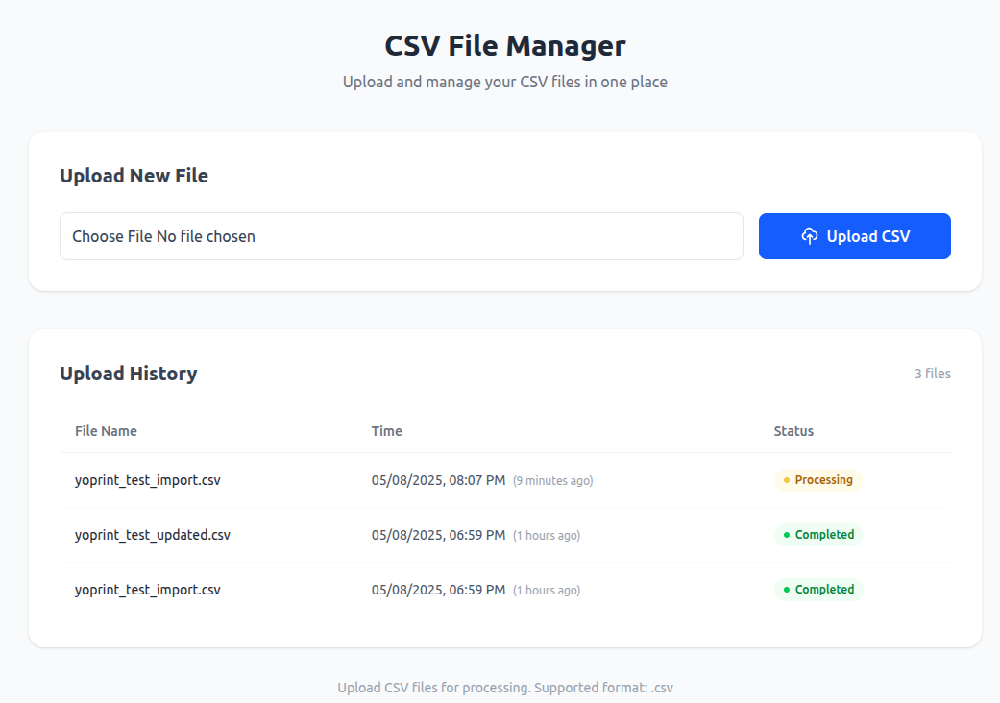

# CSV Upload & Processing App

A Laravel 12 application that allows users to upload product data via CSV, processes the data in the background, and provides real-time feedback on processing status.

<p align="center">
  <a href="https://ec9d-2001-e68-5456-4c9b-d474-c2bb-9078-17da.ngrok-free.app/">
    
  </a>
</p>


<p align="center">
  
</p>

[Download Sample CSV](./public/static/yoprint_test_updated.csv)

## 🚀 Features

* **CSV Upload Interface**
  Upload CSV files containing product data through a clean, minimal Tailwind CSS-based UI.

* **Upload History Tracking**
  View a list of all previous uploads along with their status and upload time.

* **Background Processing**
  Uses **Redis Queue** with **Laravel Horizon** to process files asynchronously without blocking the UI.

* **Real-time Status Updates**
  Status is updated using periodic polling. WebSockets were considered but not used to maintain simplicity.

* **Idempotent Uploads**
  Re-uploading the same file won't create duplicate records.

* **Upsert on Existing Data**
  If a row with the same `UNIQUE_KEY` exists, it's updated instead of inserted.

* **UTF-8 Data Cleaning**
  Automatically cleans any non-UTF-8 characters before processing the data.

## 📁 CSV File Format

CSV uploads must contain the following headers:

| Field                    |
| ------------------------ |
| UNIQUE\_KEY              |
| PRODUCT\_TITLE           |
| PRODUCT\_DESCRIPTION     |
| STYLE#                   |
| SANMAR\_MAINFRAME\_COLOR |
| SIZE                     |
| COLOR\_NAME              |
| PIECE\_PRICE             |

## 🐳 Dockerized Setup

This project is fully containerized for easy setup.

### Requirements

* Docker
* Docker Compose

### Getting Started

1. Clone the repository:

   ```bash
   git clone https://github.com/Anam-jafar/csv_processor.git
   cd csv_processor
   ```

2. Copy the environment file:

   ```bash
   cp .env.example .env
   ```

3. Run the application:

   ```bash
   docker compose up -d
   ```

4. Open your browser and navigate to the app to start uploading CSV files.

## 🧰 Tech Stack

* **Laravel 12**
* **Tailwind CSS**
* **Laravel Horizon**
* **Redis**
* **MySQL**
* **Docker & Docker Compose**

---

### 👨‍💻 Author

**Anam Ibn Jafar**

